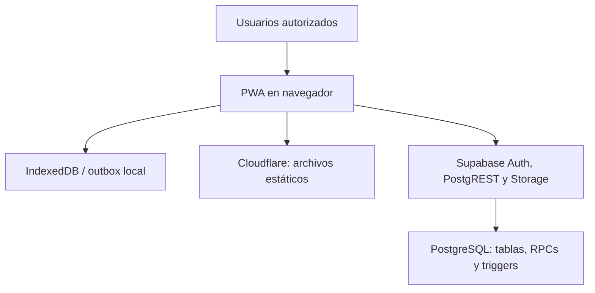
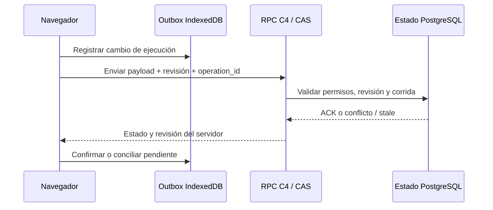

# Arquitectura observada de RigGO 12.3.7

## Componentes

Cloudflare entrega `index.html`, bundles, recursos y Service Worker. El paquete no contiene una API propia de Workers ni configuración de rutas/entornos. El navegador carga Supabase JS desde jsDelivr y usa una URL de proyecto y clave *publishable* integradas en `site/index.html`. La autenticación usa Supabase Auth; la aplicación lee `access_list` y asignaciones para funciones de acceso. La autorización **efectiva en servidor** depende de RLS, grants y las implementaciones de RPC, que IT debe verificar en Supabase.

## Capas del frontend

| Archivo | Responsabilidad observada |
| --- | --- |
| `site/index.html` | Shell, estilos y lógica inline histórica, configuración cliente, inicio de sesión y carga ordenada de módulos. |
| `site/assets/riggo-app.8fd9790e3793.js` | Modelo de Moves, planificación, Daily, reportes y sincronización C4 de ejecución con outbox en IndexedDB. |
| `site/assets/riggo-1236-operational.ecf58ba518af.js` | Controles y comportamiento operacional conservados de 12.3.6. |
| `site/assets/riggo-1217-field-integrity.ea49ec55f6bc.js` | Comprobaciones y UX de integridad de campo. |
| `site/assets/riggo-123-move-intelligence.79811e859444.js` | Move Intelligence y vistas analíticas/PDF. |
| `site/assets/riggo-1237-field-ux.1b6be3b11202.js` | Ajustes UX de campo y Reset conservados/evolucionados en 12.3.7. |
| `site/sw.js`, `site/_headers`, `site/version.json` | Caché offline, políticas de caché HTTP e identidad del build. |

El código no está modularizado como proyecto fuente. El orden de scripts y los parches inline son parte del contrato de arranque. El Service Worker renueva la caché de recursos y conserva IndexedDB; navegación usa red con fallback al HTML cacheado. La sincronización de datos sigue siendo responsabilidad de la aplicación, no del Service Worker.

## Plan y ejecución

El registro maestro de Move (`moves`) contiene la planificación y su revisión. La ejecución diaria tiene autoridad separada en `riggo_execution_state`, accesible mediante RPCs/C4. El cliente mantiene trabajo pendiente en IndexedDB para reintentos y conciliación; se usan revisiones esperadas y `operation_id` para manejar conflictos/reintentos. Hay rutas de medios y PDFs en el bucket `riggo-files`, además de tablas de períodos, cierres y reportes.

**Reset → Reactivate:** el Reset transaccional lleva ACTIVE a READY conservando el Plan y establece una nueva línea base de ejecución. Activation rota `_riggoRunId` en servidor. En la corrida actual se permite guardar desde v2/v3 con el **mismo** token; con token faltante o diferente se rechaza `stale_execution_run`. C4 12.3.7 compara también el token del outbox; si pertenece a otra corrida, descarta ese pendiente y adopta el estado del servidor sin mezclar ejecuciones. Las Moves anteriores al esquema de token siguen por la ruta legacy descrita en SQL.

## Dependencias externas observadas

- Supabase Auth, PostgREST/RPC, PostgreSQL y Storage.
- jsDelivr para Supabase JS; la página carga una versión mayor `@2` sin versión exacta fijada.
- CDN de html2canvas y jsPDF usado por Move Intelligence.
- Cloudflare como hosting indicado por el handover; el repositorio solo aporta activos estáticos y `_headers`.
- Flujos de correo/reportes existentes; el código del servicio de envío no está íntegro en este snapshot.

## No incluido en este snapshot

Topología real de Cloudflare, DNS, CI/CD, variables/secrets de entorno, esquema completo, RLS/grants, funciones Edge, backups, monitoreo, código fuente anterior a los bundles y pruebas E2E contra servicios productivos. Cualquier diagrama de esos componentes requerirá validación de IT.
