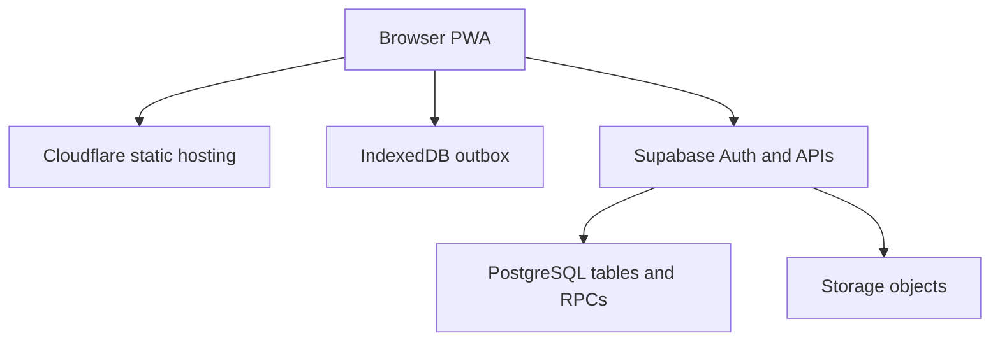
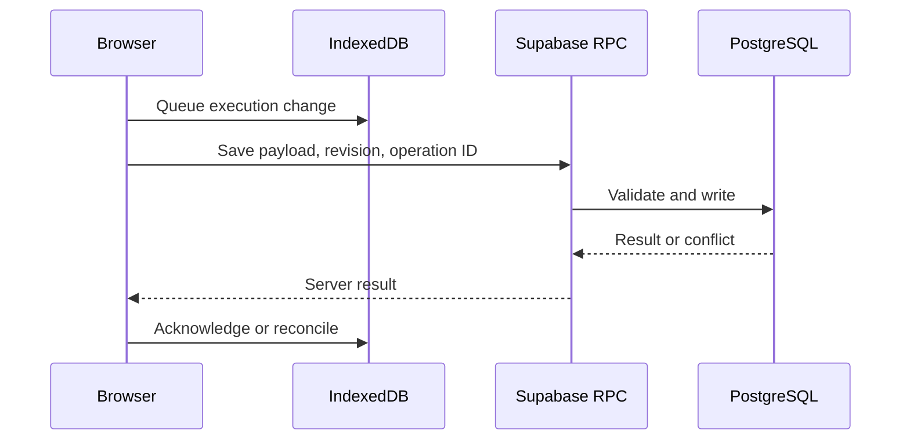

# Architecture

RigGO 12.4.1 is a browser application served as static files. The browser authenticates with Supabase and calls its database API, RPC functions, and Storage directly. No application server or Cloudflare Worker code is present in this repository.

## Runtime files

| File | Role |
| --- | --- |
| `site/index.html` | Page shell, inline application logic and configuration, and ordered script loading. |
| `site/assets/riggo-app.7977783ec134.js` | Move data, planning, Daily reports, and C4 execution synchronization. |
| `site/assets/riggo-1236-operational.94deddbef72a.js` | Operational controls. |
| `site/assets/riggo-1217-field-integrity.a63b4b30cfbb.js` | Field checks and UI behavior. |
| `site/assets/riggo-123-move-intelligence.e40084544216.js` | Move Intelligence and reporting views. |
| `site/assets/riggo-1237-field-ux.60bb436fb5e5.js` | Field UX and Reset interactions. |
| `site/sw.js`, `site/_headers`, `site/version.json` | Offline caching, cache headers, and release metadata. |

The bundles and inline scripts are release files. Their load order matters. The Service Worker caches assets and has a network-first navigation fallback; IndexedDB stores pending application data and is managed by the application code.

## Move and execution state

`moves` holds the master Move, Plan, lifecycle status, and revision. `riggo_execution_state` holds the current execution payload and its revision. C4 queues local execution work in IndexedDB, then uses Supabase RPCs to save with an expected revision and `operation_id`. A conflicting revision requires reconciliation. PostgreSQL remains authoritative for execution state.

Reset moves an active Move back to ready while retaining its Plan and establishing a new execution baseline. Activation starts a new execution run and rotates `_riggoRunId` on the server. For a tokenized row, an ordinary save with a missing or different run ID is rejected as `stale_execution_run`; a matching run ID still passes through the usual authorization and revision checks. C4 discards queued work from an older run and adopts server execution state without merging across runs. Legacy rows without a run ID retain their compatibility path.

## External dependencies

The 12.4.1 package self-hosts Supabase JS 2.117.3, html2pdf.js 0.10.1, html2canvas 1.4.1 and jsPDF 2.5.1. Their npm tarball integrity was verified before extraction; browser SRI and provenance records are in `site/assets/vendor/`. Startup and PDF rendering do not require a CDN. Authentication, database and file storage still require the existing Supabase project. See `site/version.json` for the current hashed asset names and `docs/OPERATION_RULES.md` for hourly plan and transport definitions.
